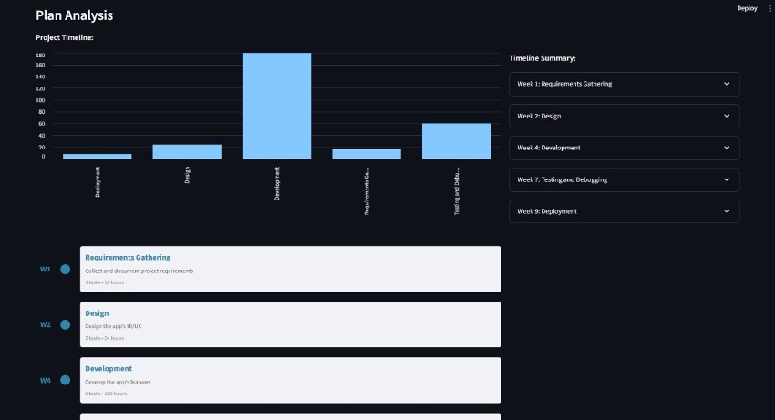

# AI Planner Agent

Generate 4–12 week project plans from a one‑page brief in seconds.



## Quick Start

1. **Clone & enter**:

   ```bash
   git clone <repo> && cd ai-planner-agent
   ```
2. **Install**:

   ```bash
   pip install -r requirements.txt
   ```
3. **Configure**:

   * Copy `.env.example` → `.env`, set `GROQ_API_KEY`
4. **Run**:

   ```bash
   streamlit run app.py
   ```
5. **Use**:

   * Paste or upload your brief
   * Click **Generate Plan**

## Tech

* Streamlit frontend
* Python + Pydantic backend
* Docker & Kubernetes ready

